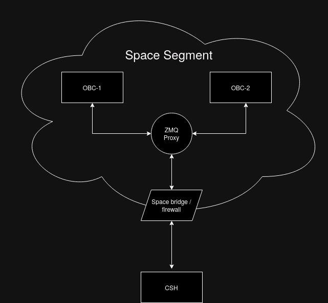

# Thesis code

This repository contains the code for the simulator developed during my master thesis.
It includes the simulator and the AEAD implementation.
Not all source code for this research could be released due to some constraints regarding proprietary licenses.

# Building, running, etc.

Common commands (for compiling, etc.) can be found in the `justfile` for use with the [just](https://github.com/casey/just) command line program.  
Running just without any arguments gives you the commands it defines in a list format with a small description.  

```sh
just setup
just build
```

### Or using a docker container

First run: `just docker-container` if the container is not yet built.

```sh
just docker-setup
just docker-build
```

### Running

Run using `./build/obc-simulator`, or `just r`, add the `-h` flag for a help menu for the simulator itself.

### Testing the connection

You can test the response using csh by addressing node 11.  
csp scan will also discover it.

```
csh -i udp.csh

csp scan
node 11
ping
...
```

# General info about CSP and CSH

The `csp_callback` function defined in `main_csp.c` handles the csp packet.  
`csp_service_handler` must be called from within this callback to handle the normal csp functionality (0-6).

- 0: CMP, management, memory, routes, stats, etc.
- 1: PING, return ping
- 2: PS, current process list
- 3: MEMFREE, get amount free memory
- 4: REBOOT, only works if the magic word is correct
- 5: BUF\_FREE, get amount of free csp buffer
- 6: UPTIME, get uptime

For additional commands, such as the ones used by csh, we have to use our own implementation:

- `pull` = 10
- `list download` = 12
- etc.

## Mitigation

Authenticated Encryption with Associated Data (AEAD), implemented using [Ascon](https://github.com/ascon/ascon-c/tree/main),
specifically [this](https://github.com/ascon/ascon-c/tree/main/crypto_aead/ascon128v12/ref) implementation

# CTF



